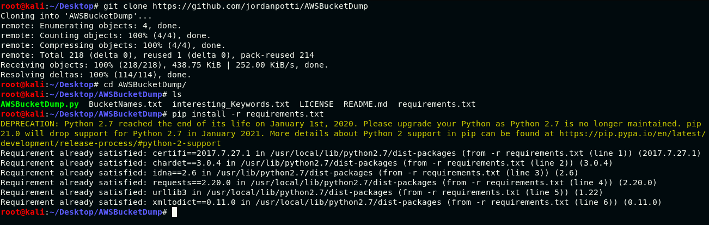
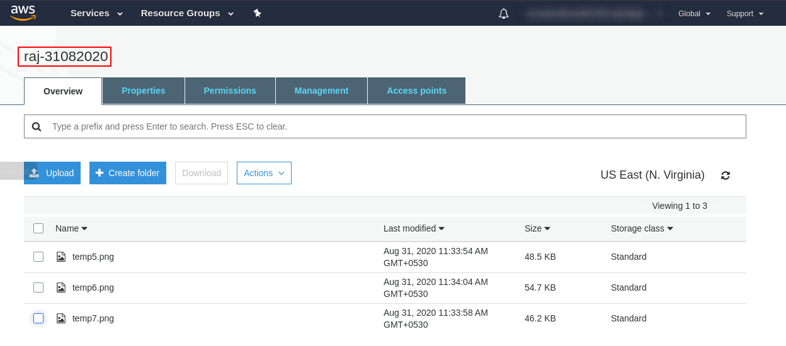
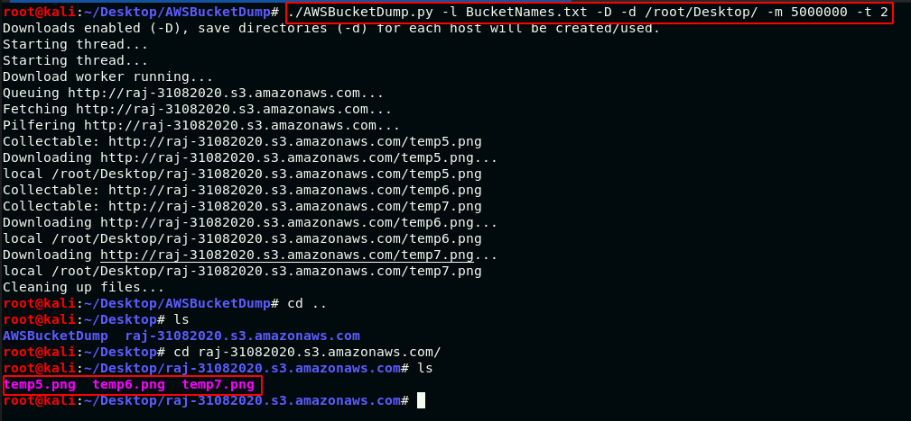

# Red Teaming Squad


## AWSBucketDump


AWSBucketDump is a tool to quickly enumerate AWS S3 buckets to look for loot. It's similar to a subdomain bruteforcer but is made specifically for S3 buckets and also has some extra features that allow you to grep for delicious files as well as download interesting files. This is a part of active information gathering.


### Installation

You can download this tool from [github](https://github.com/jordanpotti/AWSBucketDump) or using following commands.


```
git clone https://github.com/jordanpotti/AWSBucketDump
cd AWSBucketDump
pip install -r requirements.txt
```

<kbd></kbd>


### Usage

You can check its usage using ```./AWSBuckerDump.py -h```

```
./AWSBucketDump.py -h
usage: AWSBucketDump.py [-h] [-D] [-d SAVEDIR] -l HOSTLIST [-g GREPWORDS]
                        [-m MAXSIZE] [-t THREADS]

optional arguments:
  -h, --help    show this help message and exit
  -D            Download files. This requires significant disk space.
  -d SAVEDIR    If -D, then -d 1 to create save directories for each bucket
                with results.
  -l HOSTLIST
  -g GREPWORDS  Provide a wordlist to grep for.
  -m MAXSIZE    Maximum file size to download.
  -t THREADS    Number of threads.
```

### Example

Here I have created a s3 bucket and that bucket is publicly accessible. There are three images in this bucket.

<kbd></kbd>

Now run ```./AWSBucketDump.py -l BucketNames.txt -D -d /root/Desktop/ -m 5000000 -t 2``` and observe the output which stores the images in ```/root/Desktop/<BucketName>```.

<kbd></kbd>

### Note

1. Bucket and its objects must be public.
2. If bucket is public and any specific object is not public then this tool can not download that specific file.
