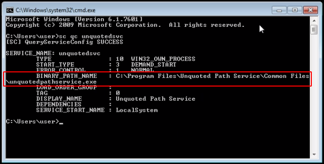
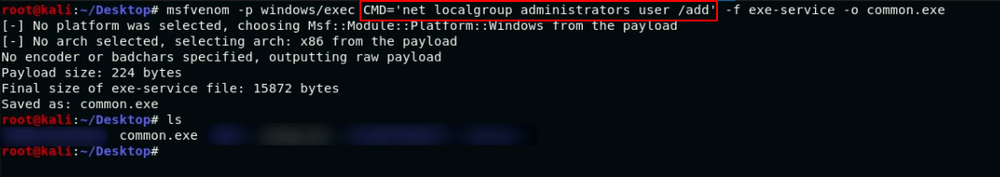
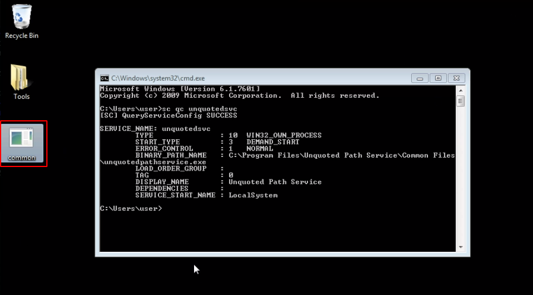
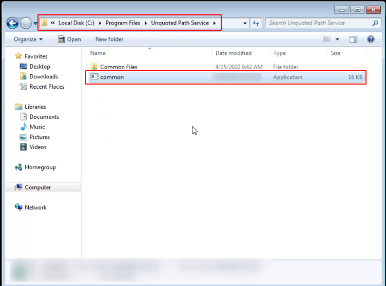
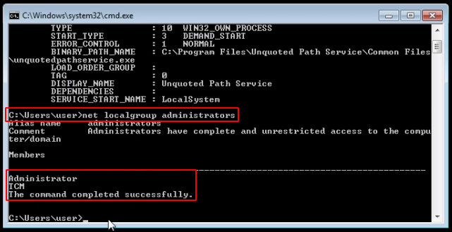
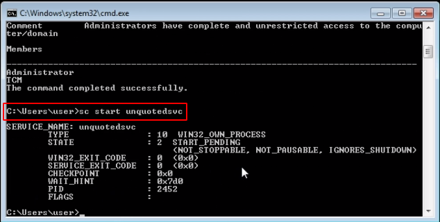
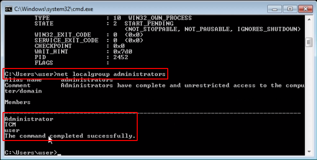

# Red Teaming Squad : Privilege Escalation


Privilege escalation is the act of exploiting a bug, design flaw or configuration oversight in an operating system or software application to gain elevated access to resources that are normally protected from an application or user.


## Unquoted Service Path

The vulnerability is related to the path of the executable that has a space in the filename and the file name is not enclosed in quote tags (""). Also, if it has writable permissions, then an attacker can replace the executable file with its malicious exe file, so as to escalate admin privileges.

### Steps

Run ```sc qc unquotedsvc``` command and observe the BINARY_PATH_NAME from the output. Here file name is not in enclosed quotes ("") so its vulnerable to unquoted service path attack.

<kbd></kbd>

Now create a malicious exe file using msfvenom or any other tool. Here I am using msfvenom and creating a exe file which will add ```user``` user into local administrator group. 

<kbd></kbd>

Move the malicious exe file to target machine.

<kbd></kbd>

Here you have many option for path where you can put the malicious exe file. Here BINARY_PATH_NAME is ```C:\Program Files\Unquoted Path Service\Common Files\unquotedpathservice.exe```. When we run the service, it will try to execute ```C:\Program.exe``` file but there is no file named ```Program.exe``` in ```C:\``` directory. So it will try to execute the ```C:\Program Files.exe``` file but there is no file named ```Program Files.exe``` in ```C:\``` directory. So it will try to execute ```C:\Program Files\Unquoted.exe``` file.

This means that it will attempt to execute the file as if any of those were correct, starting at the shortest and moving up to the longest path until one works. Therefore if you can create a file in the root of C:\ called Program.exe, when Windows attempts to start the service it will first try to execute your program and not the valid EXE. However by default you will not have write permissions to these directories as a domain user or local user. Here we have write access in ```C:\Program Files\Unquoted Path Service\``` directory so we are moving our malicious file at ```C:\Program Files\Unquoted Path Service\Common.exe``` location. So when user will start the service, our malicious file will be executed instead of valid exe file.

<kbd></kbd>

Now check the local administrators using ```net localgroup administrators``` command.

<kbd></kbd>

Start the service using ```sc start unquotedsvc``` command.

<kbd></kbd>

Now check the local administrators again using the same command.

<kbd></kbd>

Observe that our user is added into local administrators.

