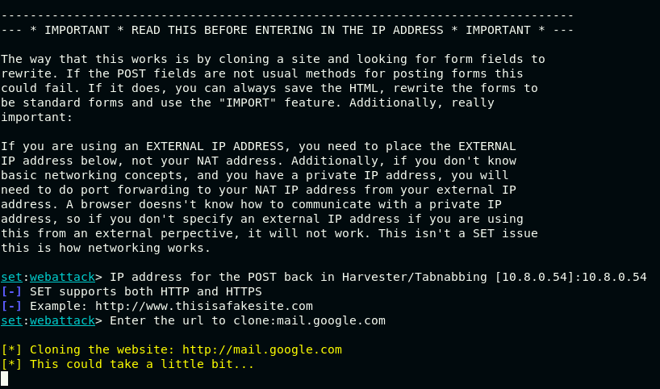
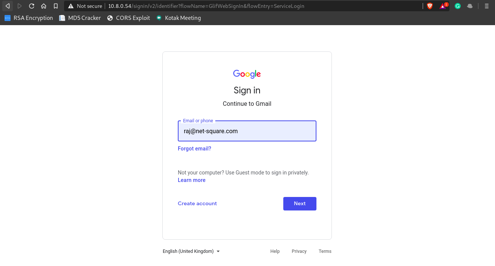

# Red Teaming Squad


## Social Engineering Toolkit

The Social-Engineer Toolkit is an open-source penetration testing framework designed for social engineering. SET has a number of custom attack vectors that allow you to make a believable attack quickly. SET is specifically designed to perform advanced attacks against the human element.


### Installation

You can install "Social Engineering Toolkit" using following commands:

```
git clone https://github.com/trustedsec/social-engineer-toolkit/
cd social-engineer-toolkit
pip3 install -r requirements.txt
```

### Usage

Run ```python setup.py``` command and select option as per your requirement. Here I want to dump the credentials so I am using "Social-Engineering Attacks" option.

<kbd></kbd>

You can select the attack type from the menu. Here I am selecting "Website Attack Vectors" option.

<kbd></kbd>

You can select any method from the menu. Here I am selecting "Credential Harvester Attack Method" option.

<kbd></kbd>

You can select any option from the menu. Here I am selecting "Site Cloner" option.

<kbd></kbd>

Now you have to enter the URL of the website which you want to clone. Here I am entering "mail.google.com".

<kbd></kbd>

Social Engineering Toolkit will host the cloned website on your localhost. You can use port forwarding to access the cloned website over internet. Send the URL to victim and vitim will enter his/her credentials in cloned website and you will get the credentials of the victim.

<kbd></kbd>

As soon as the victim hits sign in, we are presented with the credentials.

<kbd></kbd>

For more use cases, visit this [URL](https://github.com/trustedsec/social-engineer-toolkit/raw/master/readme/User_Manual.pdf).
