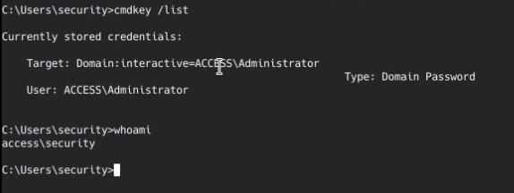
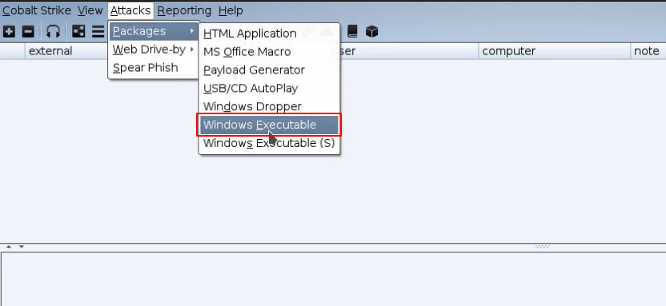
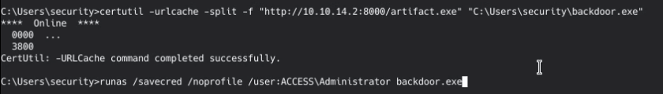
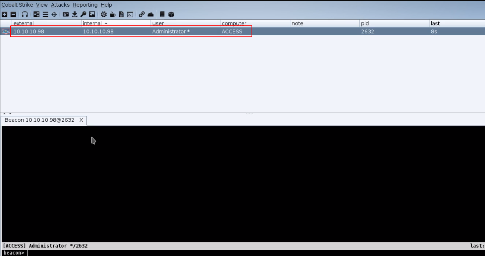
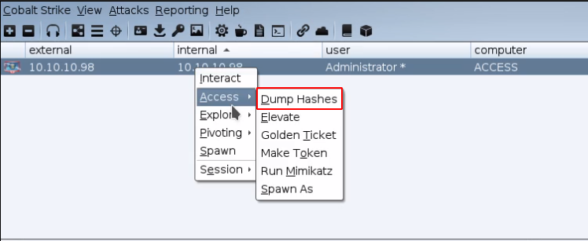
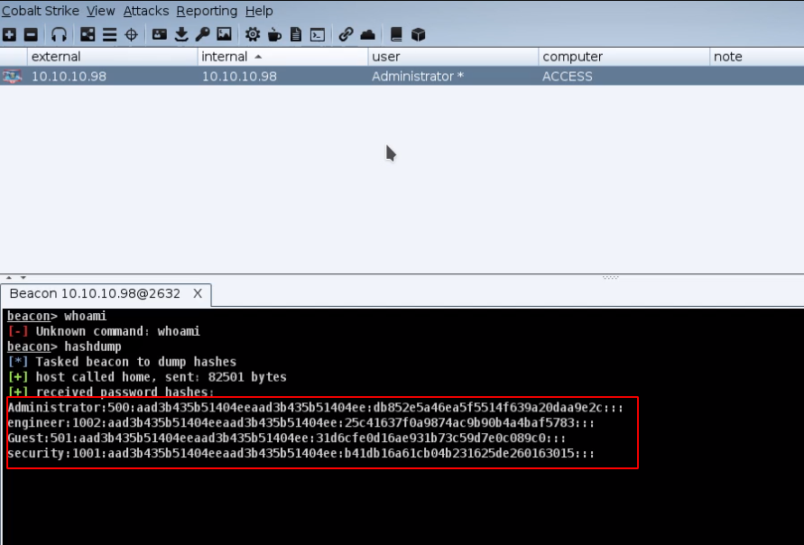

# Red Teaming Squad : Credential Access


## Windows Access Token

Windows manages identity and security information in a structure known as an Access Token. These data structures contain things like: your username, groups, privileges, and other information. An Access Token may also contain information to restrict your rights. When working with Windows, it’s important to understand that an access token isn’t a single thing that represents a user’s identity. An access token is an instantiation of an identity with a lot of variables thrown in. It’s a little painful to use runas.exe from a remote access tool. This program doesn’t accept a password as an argument. Cobalt Strike’s Beacon has a built-in runas command to give you similar functionality. The process that runas starts has an access token populated with the same single sign-on information you would expect from access tokens made by a normal login. You can steal a token from a program started by runas and use that token to interact with local and remote resources.


### Steps to reproduce

As this is post exploitation technique, you must have the interactive session running on your target machine.

<kbd></kbd>

Now from your target machine you have to create a executable file which you will use as a backdoor. Here I am using cobalt strike to create a executable file.

<kbd></kbd>

Now transfer the executable file to your victim and run the executable file using  ```runas /savedcred /noprofile /user:<TARGET_USER> <EXECUTABLE_FILENAME>``` command.

<kbd></kbd>

Observe the listener at your attacker's machine where you will get the session. Now you can interact with your machine.

<kbd></kbd>

Now you can use different post ecploitation stuffs. Here I am using "Dump Hashes" functionality of cobalt strike to dump the hashes of all the users.

<kbd></kbd>

Observe the hashes of all the users on that machine. Now you can crack the hashes using different tools like hashcat or you can perform "Pass The Hash" attack to gain other user's access.

<kbd></kbd>

For more information, you can visit this [URL](https://blog.cobaltstrike.com/2015/12/16/windows-access-tokens-and-alternate-credentials/).
